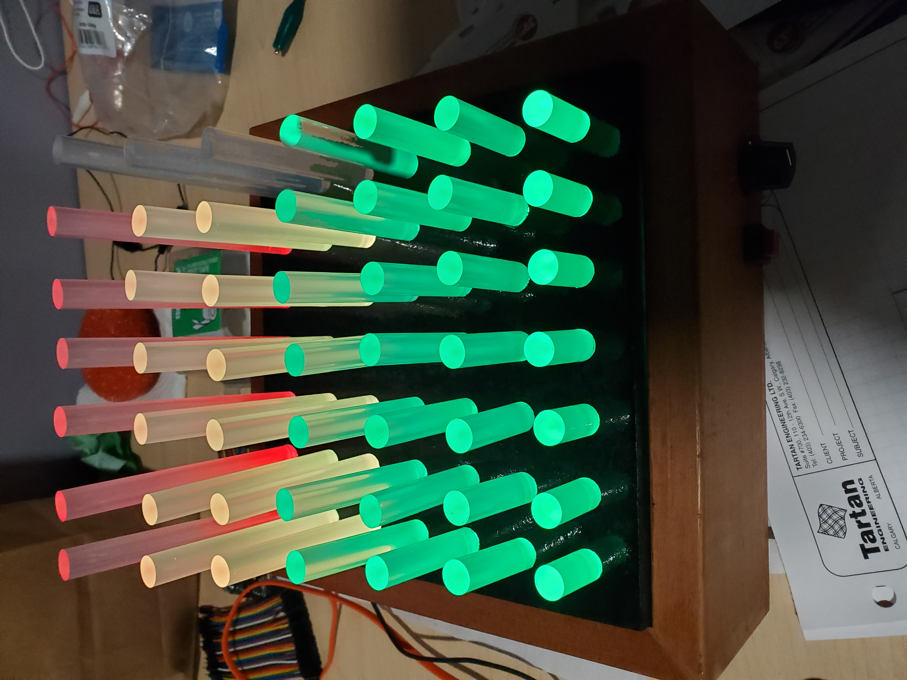
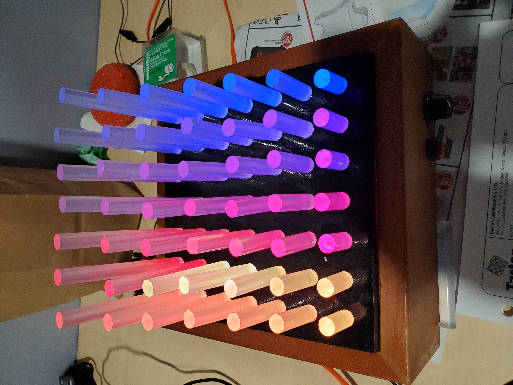
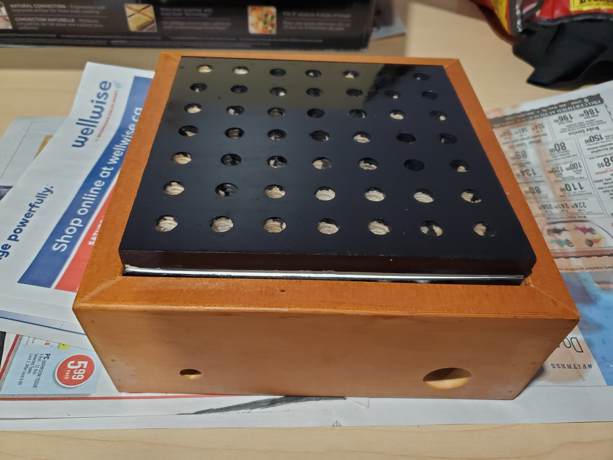
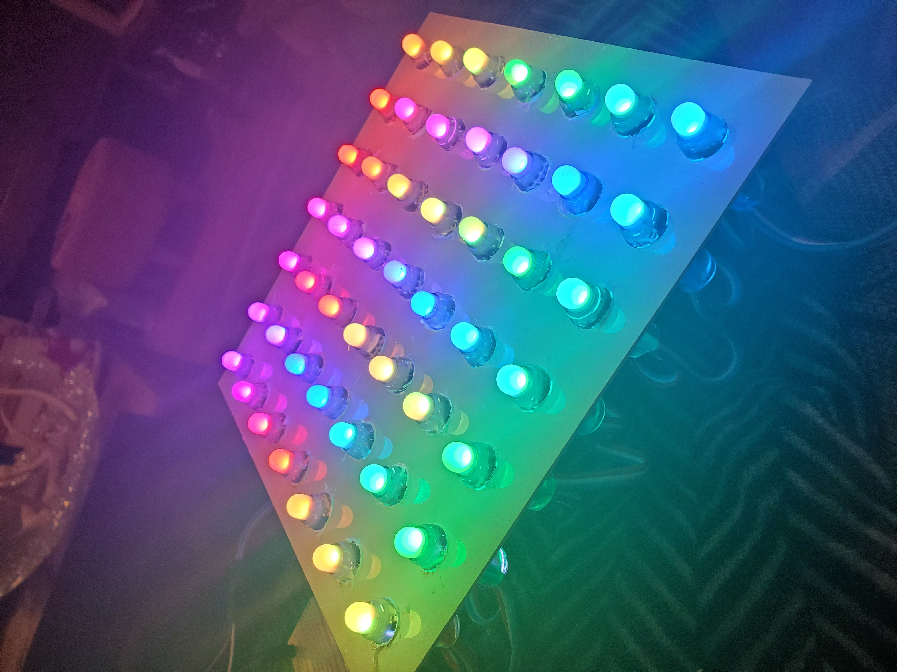
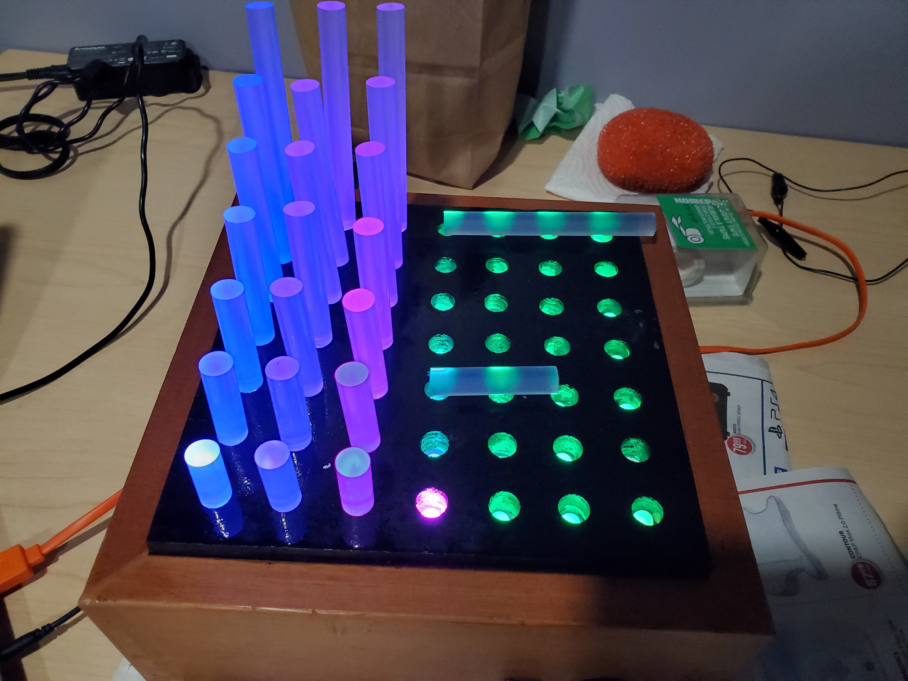
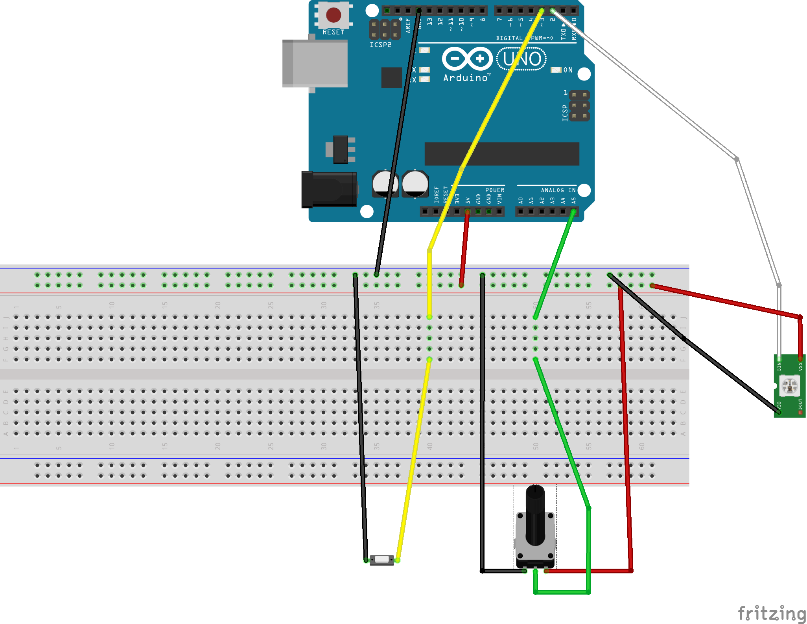
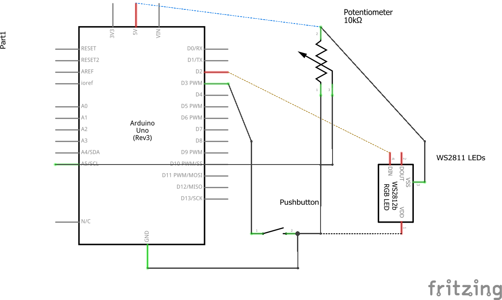

# 3D Audio Spectrum Project v1
These are the instructions and code for an Arduino 3D audio spectrometer designed for CS 207. This project uses a Sparkfun spectrum shield to create an audio spectrometer with “Fiber optics” to create a 3D visual art piece. This project is a combination of the following two projects: ["Fiber Optic" LED Matrix](https://www.instructables.com/id/Fiber-Optic-LED-Matrix/) and [Arduino LED Audio Spectrum.](https://www.instructables.com/id/Arduino-LED-Audio-Spectrum/)

## Materials 
#### Dependencies:
FastLED Animation Library http://fastled.io/ 

#### Bill of Materials:
- Arduino Uno
- Sparkfun Spectrum Shield
- 49 x WS2811 RGB LEDs
- 49 x glue sticks
- Push button
- 10k potentiometer 
- Wood
- Jumper cables
- Alligator cables or wire
- Breadboard 
- Double sided tape
- USB cord or power supply
- Thick plastic 
- Audio Cable

## Build instructions:
The frame/box of the project were made by hand using wood. It has two main parts: the top part where the LEDs and gluesticks sit and the frame that supports the top part and hides the wires. The top parts dimensions are 7 ½ ” x 7 ½ “ x ½ “. There are 49 1 inch diameter holes drilled into it that are in a grid pattern that are 1 inch apart from another with a ¾” gap from the edges. The top part was stained black to help the LEDs stand out. The LEDs are held in place by a thick piece of plastic with 1 ¼" diameter holes that the LEDs can snap into.

Double sided tape was used to help hold the plastic sheet with the LEDs to the wood top to get a better fit. The frame is made from 4 3 ½” x 3/4” pieces of wood to create a 9” x 9” frame. Small 1 inch thick pieces of wood are affixed to the inside of the left and right sides of the frame to give the top piece a surface to sit on. Holes were also drilled into the frame to make spots for the push button, potentiometer, power switch (unused), and a cable exit. For the glue sticks the tallest row is 4” tall with each following row being shortened by ½”. The shorter height stick can be the unused portion that was cut off of the taller glue sticks. The glue sticks are friction fitted into the holes, the holes here were a little too small so it was difficult to get the glue sticks in and even more difficult to adjust how they sit.

The first thing to do for the electronics will be to solder the headers to the spectrum shield. A guide can be found here: [Spectrum Shield Hookup Guide.](https://learn.sparkfun.com/tutorials/spectrum-shield-hookup-guide) Once the arduino is set up you can begin hooking up the components as shown below. I used jumper cables for the breadboard and LEDs. For the push button and potentiometer I used alligator clips to easily hook up them up to the breadboard. 

## Install
To run the software use the code within the src file and load it on the arduino along with the FastLED library. 

## Usage
To use the audio spectrometer you will need to hook an audio cable to the spectrum shield and provide a power source to the arduino. Once powered on LEDs will light up if hooked up correctly and audio is playing. There are different modes that change how the LEDs light up:
1. Red audio spectrometer.
2. Green-yellow-red traditional audio spectrometer
3. Cylon style light up
4. Changing color pallet

3 and 4 make use of the potentiometer: 3 uses it to change the speed and 4 uses it to change the color. For modes 1 and 2, it works best to play the audio on the source device at 50% - 75% for best results.

## Credits
Thanks to:
- Jbustead for the "Fiber Optic" LED Matrix project
- Apricce27 for the Arduino LED Audio Spectrum project
- Daniel Garcia for the FastLED library
- My parents
